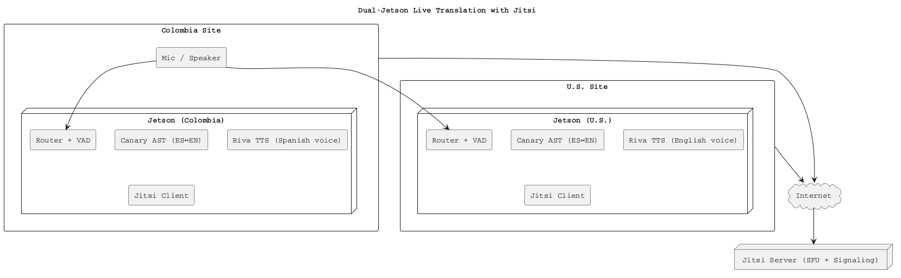

# Jetson Live Translator  
**English ↔ Spanish real-time speech-to-speech translator**  
Built on **NVIDIA Jetson Orin**, **Canary AST** (ASR + speech translation), and **NVIDIA Riva TTS**.

---

## ✨ Features
* **Two modes**
  1. **Local Mode** – Two headsets for in-person bilingual conversation (translation entirely on the Jetson).
  2. **Jitsi Call Mode** – Jetson joins a self-hosted Jitsi Meet call and provides **real-time translation for a remote caller**.

* **Switchable**:
  * **Physical switch** (USB button, GPIO, or simple push-button wired to a Jetson GPIO pin), **or**
  * **Software toggle** via a small web dashboard.

* **Low-latency pipeline**:
  * **Canary-1B-v2 AST**: speech recognition + speech-to-text translation.
  * **Riva TTS**: high-quality English & Spanish text-to-speech.
  * Typical end-to-end delay: **~0.6–1.0 s** per phrase.

---

## 🛠️ Hardware
| Item | Purpose |
|------|--------|
| **NVIDIA Jetson Orin Nano 8 GB** | Core compute |
| **2× USB audio headsets or 2× low-latency 2.4 GHz USB dongle headsets** | Mic + speaker for Local Mode |
| **Polycom SoundStation2W (or any conference mic/speaker)** | Shared mic/speaker for Jitsi Call Mode |
| **Physical toggle button (optional)** | Mode switch; any GPIO push button works |
| **USB audio interface** | For Polycom 3.5 mm TRRS cable → Jetson |

---

## 📦 Software Stack
* **JetPack 6.x** (CUDA 12.x)
* **Docker + NVIDIA runtime**
* **Canary-1B-v2 AST** – ASR + automatic speech translation (English ⇄ Spanish)
* **NVIDIA Riva TTS** – streaming text-to-speech
* **Python Router** – VAD, chunking, audio routing, and mode switching
* **(Jitsi Mode)** Chromium or Jitsi Electron client for Jetson

---

## 🚀 Quick Start

### 1. Jetson Prep
```bash
sudo apt update && sudo apt install -y docker.io
sudo usermod -aG docker $USER
sudo apt install -y nvidia-container-toolkit
sudo nvidia-ctk runtime configure
sudo systemctl restart docker
````

### 2. Clone and Build

```bash
git clone https://github.com/<yourname>/jetson-live-translator.git
cd jetson-live-translator
docker compose build
```

### 3. Download Riva Voices

Follow [Riva Quickstart](https://developer.nvidia.com/riva) to download at least:

* `en-US` voice
* `es-ES` voice

Place them in `riva/models/` and `riva/config/`.

### 4. Start Services

```bash
docker compose up
```

* `canary` – Canary AST server (HTTP)
* `riva-tts` – NVIDIA Riva TTS server (gRPC)
* `router` – translation + audio routing service

---

## 🎛 Mode Switching

### Physical switch (recommended)

1. Wire a simple **momentary push button** to a Jetson GPIO pin (e.g. `GPIO17`).
2. The router monitors GPIO state:

   * **LOW** → Local Mode
   * **HIGH** → Jitsi Call Mode
3. Change pin number in `config.yaml`.

### Software switch (alternative)

* The router exposes a tiny **web dashboard** on port 8080:

  ```
  http://<jetson-ip>:8080
  ```
* Click **Local** or **Jitsi** to toggle mode.

---

## 🗂 Config (`config.yaml`)

```yaml
mode: local        # 'local' or 'jitsi' at startup
audio:
  sample_rate: 16000
  frame_ms: 20
  burst_ms_min: 300
  burst_ms_max: 600
local_devices:
  in_A: "hw:1,0"
  out_B: "hw:2,0"
  in_B: "hw:2,0"
  out_A: "hw:1,0"
jitsi_devices:
  in: "hw:Polycom"
  out: "hw:Polycom"
languages:
  A_src: "es"
  A_tgt: "en"
  B_src: "en"
  B_tgt: "es"
tts:
  voice_A: "en-US-<riva-voice>"
  voice_B: "es-ES-<riva-voice>"
```

---

## 🧩 How the Two Modes Work

### Local Mode

```
Headset A mic → Canary (es→en) → Riva TTS (en) → Headset B speaker
Headset B mic → Canary (en→es) → Riva TTS (es) → Headset A speaker
```

### Jitsi Call Mode

```
Polycom mic → Jitsi client → Jetson router taps audio → Canary (es→en) → Riva TTS (en) → local speaker
Local mic → Canary (en→es) → Riva TTS (es) → virtual mic (ALSA loopback) → Jitsi sends to parents
```

*ALSA `dsnoop`/`dmix` is used so Jitsi and the translator can share the same USB audio device.*

---

## 📊 System Architecture



Copy this block into [https://www.plantuml.com/plantuml](https://www.plantuml.com/plantuml) or a local PlantUML renderer to view the full system diagram.

---

## 🏁 Usage

* **Local conversation:** Flip the switch to **Local**. Two people wearing the headsets can talk with near-real-time EN↔ES translation entirely offline.
* **Jitsi call:** Flip to **Jitsi**. Join the family call from the Jetson browser or Jitsi Electron client. Your parents in Colombia use the Jitsi app on their smartphone. The Jetson provides real-time EN↔ES translation both ways.

---

## 🔧 Tips

* Start with Canary greedy decoding and 300–600 ms VAD bursts for the best latency/accuracy balance.
* Riva TTS supports **streaming synthesis**—enable it to begin speaking while text is still arriving.
* If you hear echo on Jitsi calls, leave **Polycom Acoustic Clarity** enabled and keep Jitsi’s built-in echo cancellation on.

---

## 📜 License

MIT (or the license you prefer for your repository).

---

### Acknowledgements

* [NVIDIA Riva](https://developer.nvidia.com/riva)
* [Canary multilingual AST](https://huggingface.co/nvidia)
* [Polycom SoundStation2W](https://www.poly.com/)

```

---

This single README includes:
* All setup and configuration instructions,
* The dual-mode operating guide,
* And a **PlantUML architecture diagram** that renders without the syntax errors you experienced with Mermaid.
```
